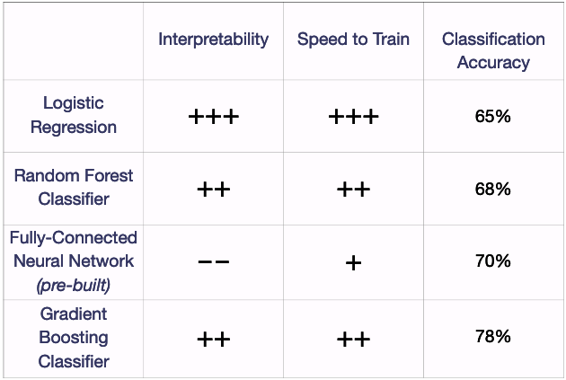
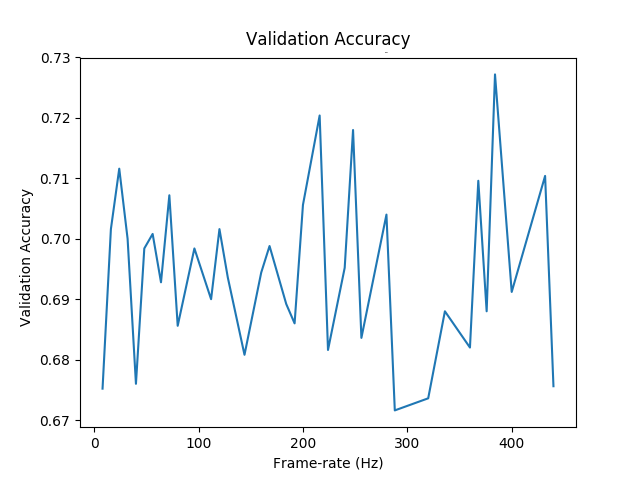
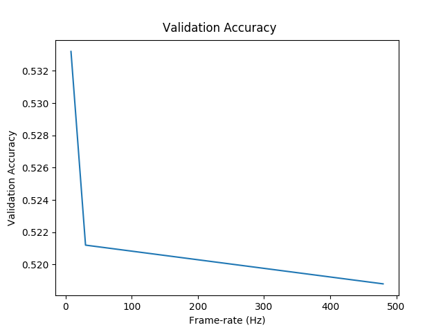
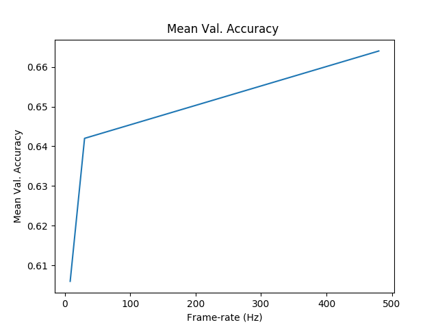
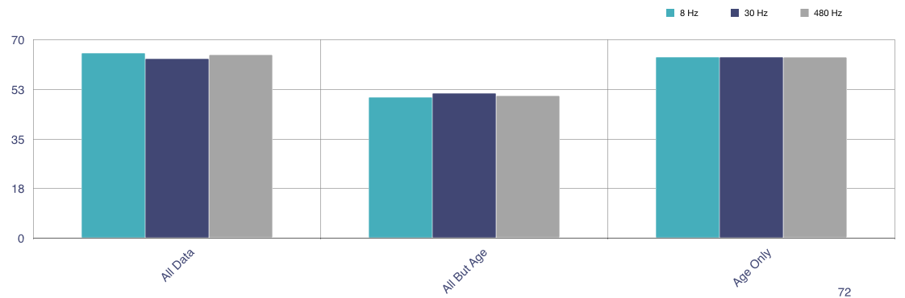
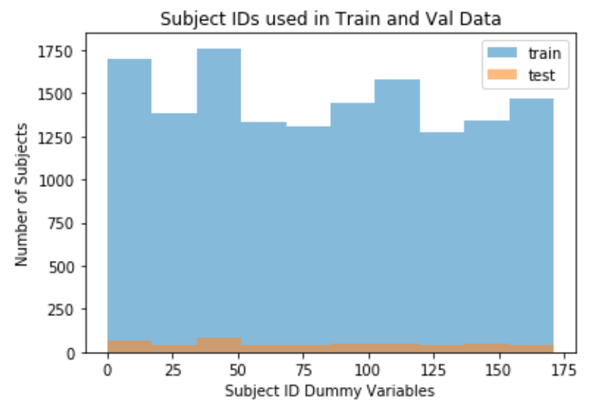
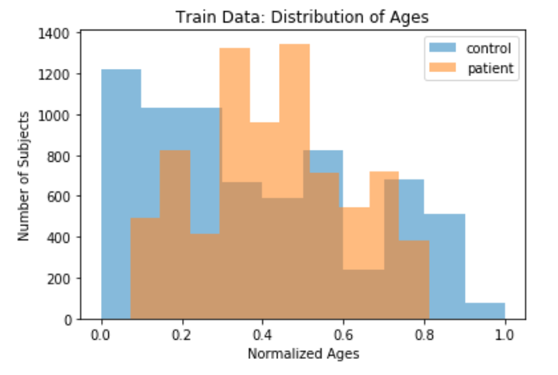
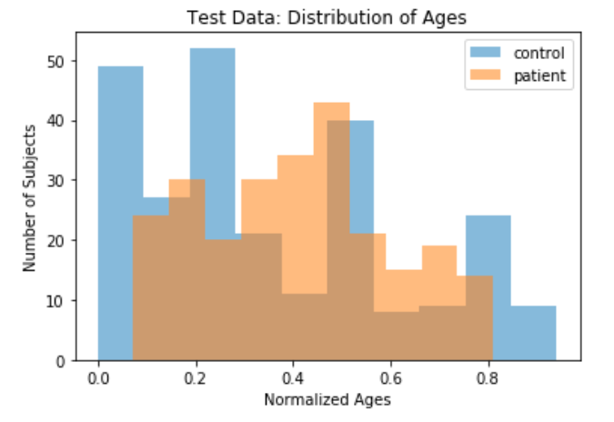

# SenseMS
<br>

***SenseMS*** was completed as an Insight Artifical Intelligence Fellow, consulting for a company that uses AI and eye-motion data to detect neurodegenerative diseases, like multiple sclerosis.
<br>

By examining classification accuracy of a neural network on downsampled sensor data, I mimiced using cheaper hardware to help the company decide how to productionize their device. ***SenseMS*** helped the company move one step closer to going to market: a $15B opportunity.

<br>

Eye-tracking time-series data *(x, y, t)*    |  Downsampled eye-traces
:------------------------:|:-------------------:
  |  
<br>

Unfortunately, due to the highly sensitive nature of the data and model confidentiality, I am not able to open-source this project. This repository was created for the benefit of the company I consulted for to conduct future testing.
<br>

`utils/build_datasets.py` takes list of frequencies and returns dictionary of downsampled eye-traces at each of the specified frequencies using `utils/downsample.py`.
<br>

As EDA showed that almost all of the pre-built model's signal was strangely coming from age data, `utils/create_data_for_testing.py` takes the downsampled eye-traces and builds datasets for testing at each frequency, as defined in `utils/datasets.py`, representing:
<center>

	1. All data
	2. All data except age
	3. Age only
</center>
<br>

`logisticregr_tests.py`, `gb_tests.py`, `rf_tests.py`, and `xgb_test.py` use the training data to return cross-validated accuracy scores for each model. These tests were used for sanity checks when the DNN was returning unusual results.
<br>

`process_results.py` uses the results of `logisticregr_tests.py`, `gb_tests.py`, `rf_tests.py`, and `xgb_test.py` to generate plots stored in the `results` directory.
<br>

## Dependencies
Anaconda is required. Download [here](https://conda.io/en/latest/miniconda.html) and install with:
```
bash Anaconda-latest-Linux-x86_64.sh
```

## Setup
Create a conda environment called `sensorframerate`:

```
conda env create -f build/environment.yml
conda activate sensorframerate
```

## Test
- After loading the conda environment, propogate the `data`, `models`, and `params` directories with the company's modules and run:

```
python logisticregr_tests.py &&
python gb_tests.py &&
python rf_tests.py &&
python xgb_test.py
```

## Analysis
- When first looking at the data I checked alternate models using the same data
and found the following results:
<p align="center">
 
</p>
<br>

- But, when investigating how sensor frame-rate affects classification accuracy, my results were strange, namely that as frame-rate decreased, classification accuracy stayed surprisingly constant:
<p align="center">
 
</p>
<br>

- When investigating which features were causing this phenomenon, I found that eye data was giving surprisingly little signal and that age was accounting for nearly all of the signal:

Eye motion data only   |  Age data only
:------------------------:|:-------------------:
 | 
<br>

- Could it be the NN architecture? I used logistic regression to compare as a sanity test and found surprisingly similar results:
<p align="center">
 
</p>
<br>

- After determining that it wasn't the model giving the strange results, I looked at the data
and found leakage that was drastically inflating the model's performance:'
<p align="center">
 
</p>
<br>

- Finally, I investigated whether age was a feature that the model should be using as a central feature, but due to the distribution of the patient age data being rougly Gaussian while the control ages have so much kurtosis, I would recommend against using age as a central feature of the model.

Age distributions in the training data   |  Age distributions in the validation data
:------------------------:|:-------------------:
 | 
<br>
