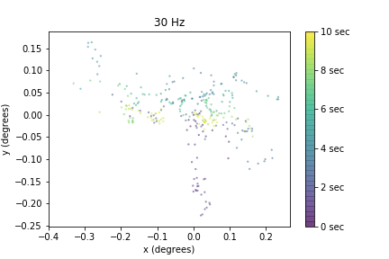

# SenseMS
<br>

***SenseMS*** was completed as an Insight Artifical Intelligence Fellow, consulting for a company that uses AI and eye-motion data to detect neurodegenerative diseases, like multiple sclerosis.
<br>
By examining classification accuracy of a neural network on downsampled sensor data, I mimiced using cheaper hardware to help the company decide how to productionize their device. ***SenseMS*** helped the company move one step closer to going to market: a $15B opportunity.

<br>

Eye-tracking time-series data *(x, y, t)*    |  Downsampled eye-traces
:------------------------:|:-------------------:
  |  


<br>
`utils/build_datasets.py` takes list of frequencies and returns dictionary of downsampled eye-traces at each of the specified frequencies using `utils/downsample.py`.

<br>
As EDA showed that almost all of the pre-built model's signal was strangely coming from age data, `utils/create_data_for_testing.py` takes the downsampled eye-traces and builds datasets for testing at each frequency, as defined in `utils/datasets.py`, representing:
<center>

	1. All data
	2. All data except age
	3. Age only
<br>
</center>
`LogisticRegr_test.py`, `GB_test.py`, `RF_test.py`, and `XGBoost_test.py` use the training data to return cross-validated accuracy scores for each model. These tests were used for sanity checks when the DNN was returning unusual results.

<br>
`train_model.py` demonstrates usage of the NN model as well as basic results from simpler ML models. These results also contain work verifying suspicions of data leakage in the pre-existing NN architecture.

<br>
`process_results.py` takes the results of `train_model.py` and generates graphs stored in the `results` directory.

<br>
`exploration.html` shows the exploration that helped to identify data leakage.


<br>
## Dependencies
Anaconda or Miniconda are required. Download [here](https://conda.io/en/latest/miniconda.html) and install with:
```
bash Miniconda3-latest-Linux-x86_64.sh
bash Anaconda-latest-Linux-x86_64.sh
```


<br>
## Setup
Create a conda environment called `sensorframerate`:
```
conda env create -f build/environment.yml
conda activate sensorframerate
```


<br>
## Test
- Include instructions for how to run all tests after the software is installed
```
# Example

# Step 1
# Step 2
```


<br>
## Run
If you have a GPU, select sample input data and a simple model to replicate the process I used to create downsampled datasets.
```
python run_wavernn.py samples/LJ016-0277.wav
```


## Analysis
- Include some form of EDA (exploratory data analysis)
- And/or include benchmarking of the model and results
```
# Example

# Step 1
# Step 2
```
